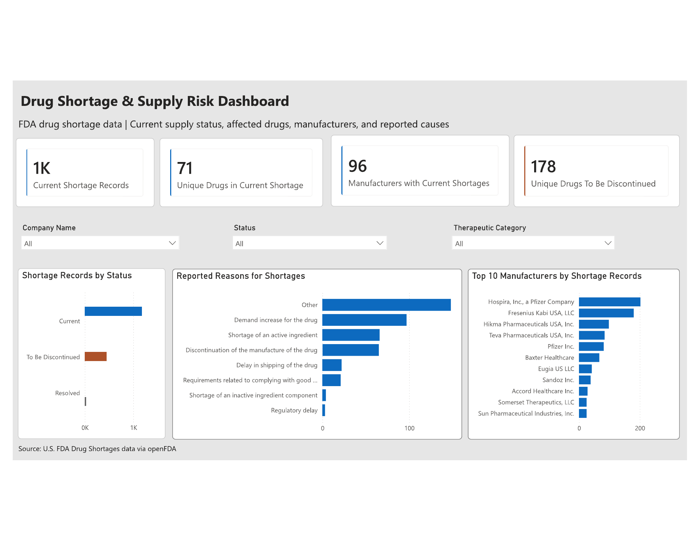

# Drug Shortage & Supply Risk Dashboard

## Project Overview
This project analyzes U.S. FDA drug shortage data to identify current supply issues, affected drugs, manufacturers, therapeutic categories, and reported causes of shortages. This is an interactive Power BI dashboard that transforms raw shortage data into a structured view of supply risk, with filters that allow users to explore patterns by company, shortage status, and therapeutic category.

## Business Question
Which drugs, manufacturers, and therapeutic categories are most affected by reported drug shortages, and what supply factors are associated with these shortages?

## Dashboard Preview

## Data Source
**U.S. Food and Drug Administration (FDA) Drug Shortages Data**

The dataset contains drug shortage records including shortage status, generic drug name, manufacturer, reported shortage reason, availability information, and therapeutic category. The final dataset used in the dashboard contains **1,651 shortage records**.

Source: U.S. FDA Drug Shortages data via openFDA.

## Tools & Technologies
* **Power BI**: Interactive dashboard development and data visualization
* **Power Query**: Data cleaning, transformation, and preparation
* **DAX**: Custom measures for shortage records, unique drugs, and manufacturer analysis
* **Data Modeling**: Relationship design for drugs, shortage records, and therapeutic categories
* **GitHub**: Project documentation and portfolio hosting

## Key Features
* Four KPI cards tracking current shortage records, unique drugs in current shortage, manufacturers with current shortages, and drugs marked to be discontinued
* Interactive filters for **company, shortage status, and therapeutic category**
* Shortage status analysis across Current, To Be Discontinued, and Resolved records
* Analysis of reported reasons associated with drug shortages
* Top 10 manufacturer ranking based on shortage records
* Therapeutic category filtering supported by a separate data model to handle drugs associated with multiple categories

## Key Findings
* **1,179 of 1,651 shortage records** were classified as Current, compared with 447 To Be Discontinued and 25 Resolved.
* Among reported shortage reasons, **Other** accounted for 148 records. Among more specific reasons, **demand increases** accounted for 97 records and **active ingredient shortages** for 66.
* **Hospira/Pfizer** was associated with the most shortage records at 202, followed by **Fresenius Kabi** at 180 and **Hikma Pharmaceuticals** at 98.
* **Anesthesia** had the highest number of associated shortage records among therapeutic categories at 379, followed by **Pediatric** at 323 and **Analgesia/Addiction** at 313.
* Therapeutic categories are not mutually exclusive, so a drug may contribute to more than one category.

## Data Preparation & Modeling
* Cleaned and transformed the raw FDA shortage dataset using **Power Query**, retaining fields relevant to shortage status, drug names, manufacturers, reported causes, availability, and therapeutic categories.
* Standardized field names and filtered the dataset for analysis while preserving the original shortage records.
* Created a separate **Therapeutic Categories** table to expand drugs associated with multiple therapeutic categories without duplicating records in the main shortage table.
* Created a distinct **Drugs** table and established relationships between the drug, therapeutic category, and main shortage tables.
* Built **DAX measures** to calculate shortage record counts, distinct drugs in current shortage, manufacturers with current shortages, and drugs marked To Be Discontinued.

## Challenges
* The **Therapeutic Category** field contained multiple values for some drugs, which required a separate table rather than expanding the main dataset and duplicating shortage records.
* Manufacturer and drug names appeared across multiple records, requiring distinct-count measures to avoid overstating the number of affected drugs and manufacturers.
* Long shortage-reason and manufacturer labels required adjustments to chart sizing and layout to maintain readability.
* The dashboard needed to balance detailed supply-risk information with a compact one-page design, so the final view focused on the most decision-relevant KPIs, filters, and rankings.

## What I Learned
* Developed experience transforming raw healthcare data into an interactive **Power BI dashboard**.
* Strengthened my understanding of **Power Query, DAX measures, and relational data modeling**.
* Learned how data structure affects analysis, particularly when one drug is associated with multiple therapeutic categories.
* Improved my ability to select KPIs and visualizations that communicate operational patterns without overcrowding a dashboard.
* Practiced translating technical analysis into clear findings about drug supply and shortage patterns.

## Limitations
* The dashboard reflects the FDA drug shortage records contained in the dataset and should not be interpreted as a complete measure of all drug supply disruptions.
* A single drug may be associated with multiple therapeutic categories, so therapeutic category counts overlap and should not be added together.
* The reported shortage reason **Other** is a broad category and does not identify a specific underlying supply issue.
* Manufacturer counts represent the number of shortage records associated with each company and do not indicate that a manufacturer caused a shortage.
* The dashboard provides a snapshot of the source data rather than a historical trend analysis over time.

## Files
* **`Drug_Shortage_Supply_Risk_Dashboard.pbix`**: Editable Power BI project containing the dashboard, data model, transformations, and DAX measures.
* **`Drug_Shortage_Supply_Risk_Dashboard.pdf`**: One-page export of the completed dashboard.
* **`dashboard-preview.png`**: Dashboard preview image displayed in this README.
